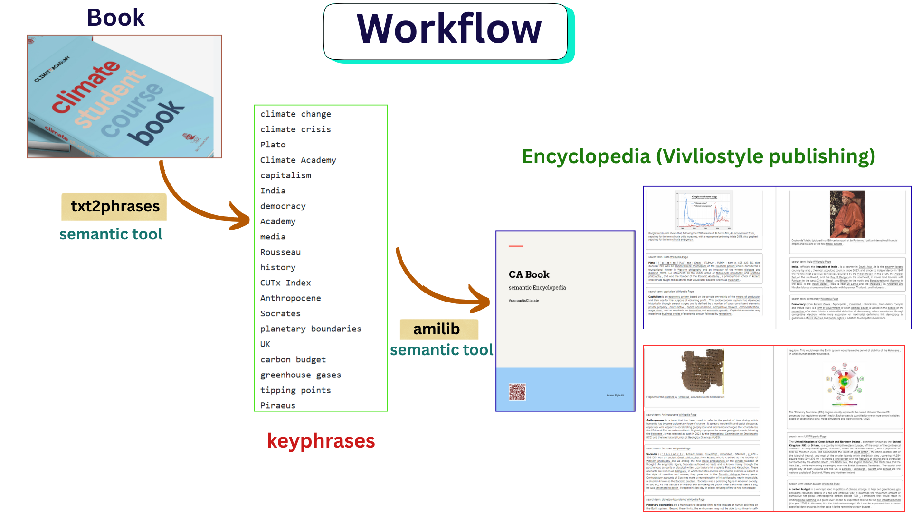

# demo_CAbookEncyclopedia

## [Link to the Encyclopedia](https://vivliostyle.org/viewer/#src=https://github.com/semanticClimate/demo_CAbookEncyclopedia/blob/main/manifest.jsonld)

### List of words/keyphrases extracted from the book | [Click Here](https://github.com/semanticClimate/encyclopedia/blob/renu/CAbook_encyclopedia/All3088_CAbook_words.txt)

## [Link to Knowledge Graph](https://github.com/semanticClimate/demo_CAbookEncyclopedia/blob/main/CA_encyclopedia_KG.html)



## Creating an Encyclopedia from a Book/Report Using *txt2phrases* and *amilib*

This document outlines the steps to create an encyclopedia derived from a book by extracting keywords and linking them to information from [Wikipedia](https://www.wikipedia.org/).

---

### 1. Extract Keyphrases from the Book/Reports

Use the [txt2phrases](https://pypi.org/project/txt2phrases/0.2.0/) tool to identify and extract significant concepts or multi-word expressions from the text.
- Input: folder with txt files


```
extract_keywords -i path/to/txt_folder -o path/to/output_folder -n 3500

```

### 2. Create Encyclopedia Using `amilib`

Use the [amilib](https://pypi.org/project/amilib/1.0.0a9/) library to fetch structured information for each extracted phrase from Wikipedia and compile them into an encyclopedia format.

```
amilib DICT --words CAbook_words.txt --description wikipedia --dict CA_encyclopedia.html --figures --operation create

```

### 3. Visualization using Vivliostyle publishing

- [Click Here to read about installation and usage](https://github.com/semanticClimate/hyperbook-template)


